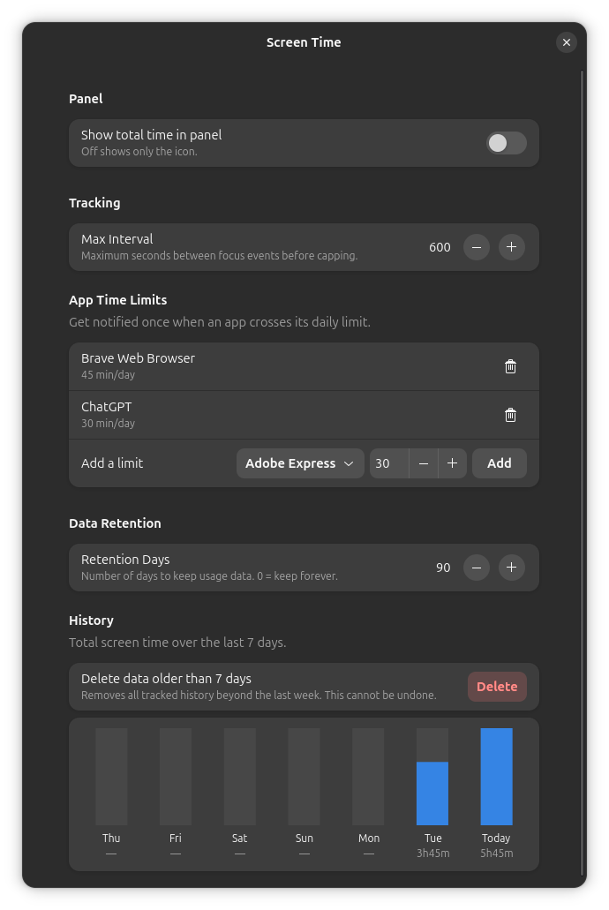

# Screen Time

A GNOME Shell extension that tracks how long you spend in each app, macOS Screen Time style.

The panel shows today's total at a glance. Click it for a per-app breakdown, and step back through previous days one at a time.


## Features

- **Panel indicator:** today's total next to the clock, or just the icon if you prefer.
- **Per-app breakdown:** top five apps with usage bars and percentages; everything else folds into a collapsible "Other N apps" row, so the numbers always add up to the total.
- **Day-by-day history:** `‹ Today ›` steps back one day at a time.
- **App time limits:** set a daily limit per app and get a desktop notification once you cross it.
- **7-day chart** in preferences, with configurable retention and a one-click purge.
- **Presence-aware:** time on the lock screen, while the screen is blanked, or while suspended is never counted.
- **Local only:** a plain JSON file on your disk. No network access, no telemetry.

## Requirements

GNOME Shell 47, 48, 49 or 50. X11 or Wayland.

## Install

```bash
git clone https://github.com/itsdigvijaysing/gnome-screen-time
cd gnome-screen-time
make install
```

Then reload GNOME Shell and enable it:

- **Wayland:** log out and back in (there is no in-session reload).
- **X11:** press `Alt`+`F2`, type `r`, press `Enter`.

```bash
gnome-extensions enable screen-time@gnome-screen-time
```

## Preferences

Open from the gear icon at the bottom of the popup, or:

```bash
gnome-extensions prefs screen-time@gnome-screen-time
```



## Settings

| Setting | Default | What it does |
|---|---|---|
| Show total time in panel | On | Off shows only the icon. |
| Max interval | 600s | Caps any single tracked stretch, so a stall can't dump hours onto one app. |
| App time limits | none | Per-app daily limit in minutes; notifies once per day when crossed. |
| Retention days | 90 | How long history is kept. `0` keeps it forever. |

## How time is measured

Time is attributed to the app owning the **focused window**, updated on every focus change and every 30 seconds. Some consequences worth knowing:

- A video playing in an **unfocused** window is not counted: this measures interaction, not playback.
- Tracking **stops** when the screen blanks, when the session locks, and across suspend. It resumes from the moment you come back, so the gap belongs to nobody.
- After **10 minutes without keyboard or mouse input** (Idle Timeout in preferences, 0 to disable) counting stops even if the screen stays on, unless something is inhibiting idle the way a playing video does, and resumes on the next input. Time up to the timeout is still counted, so a walk-away costs at most one timeout of over-count.
- Apps without a `.desktop` file (typically AppImages) are identified by their window class, so their history accumulates instead of splitting across launches.
- A day runs from midnight by default. **Day Starts At** in preferences moves that boundary, so 4 keeps work between midnight and 4am on the day it started rather than opening a new one. Changing it is not retroactive: time already filed under a date stays there.

## Data

Usage is stored at:

```
~/.local/share/gnome-shell/screen-time/usage.json
```

It is keyed by date, then by app, where the date is the logical day set by **Day Starts At**. Delete the file to reset everything, or use **Delete data older than 7 days** in preferences. Anything older than the retention setting is removed automatically.

## Development

```
src/        extension sources, metadata.json, stylesheet.css, schemas/
tests/      unit tests, run by `make test`
dist/       packaged release archive (build output)
assets/     screenshots
```

```bash
make            # compile the GSettings schema
make install    # install to ~/.local/share/gnome-shell/extensions/
make reload     # load src/ into the running Shell under a fresh dev UUID (no logout)
make unreload   # back to the installed production copy
make uninstall
make check      # syntax-check every module + validate metadata.json
make test       # unit tests under plain gjs (tests/), then tests/install.sh
make pack       # build dist/screen-time@gnome-screen-time.shell-extension.zip
make clean
```

`make check` uses `gjs -m`. Note that `gjs -c` runs a string and does **not** check syntax. `ImportError` for `resource:///org/gnome/...` and missing `Shell` typelibs are expected outside a live Shell; only `SyntaxError` counts as a failure.

`make test` runs `tests/` under plain `gjs`, no Shell involved, so it covers the modules that import nothing from `resource:///org/gnome/shell`: `formatTime.js`, `appLimits.js` and `usageStore.js`. The runner points `XDG_DATA_HOME` at a scratch directory before importing anything, so a run cannot touch real usage data.

GNOME 45+ caches an extension's modules for the life of the Shell, so re-enabling one never picks up new code, and Wayland cannot restart the Shell in place. `make reload` sidesteps both: it copies `src/` under a new dev UUID, disables the production copy, and asks the running Shell to load the new one through `org.gnome.Shell.Eval`. Eval answers only while Looking Glass's Unsafe Mode is on (Alt+F2, `lg`, the toggle in its top bar), which lasts for the login session; turn it back off when you are done iterating. `make unreload` removes the dev copy and re-enables the production UUID, and `make install` does the same automatically, so ending a dev session is just `make install`.

The packaged archive is validated with [shexli](https://pypi.org/project/shexli/) before release:

```bash
shexli dist/screen-time@gnome-screen-time.shell-extension.zip   # expects: clean (0 findings)
```

## License

[GPL-3.0](LICENSE)
